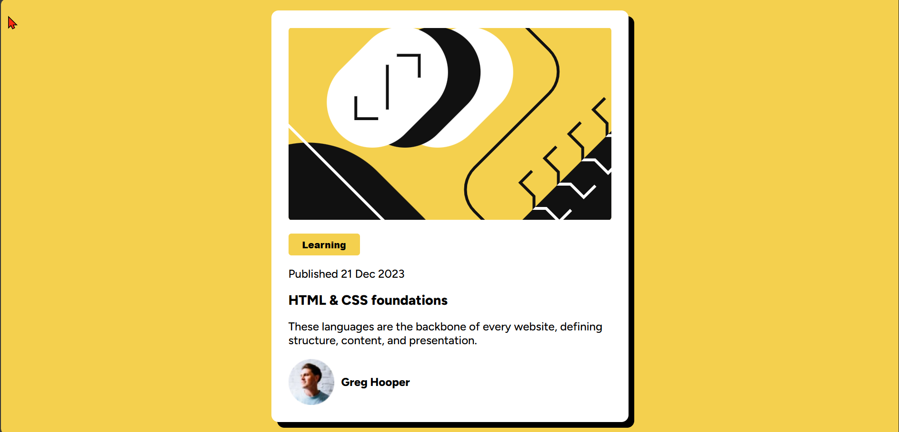
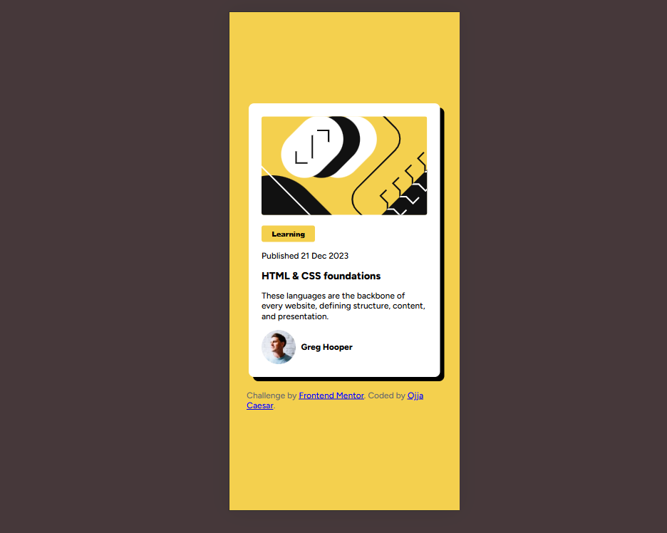

# Frontend Mentor - Blog preview card solution

This is a solution to the [Blog preview card challenge on Frontend Mentor](https://www.frontendmentor.io/challenges/blog-preview-**card**-ckPaj01IcS). Frontend Mentor challenges help you improve your coding skills by building realistic projects.

## Table of contents

- [Frontend Mentor - Blog preview card solution](#frontend-mentor---blog-preview-card-solution)
  - [Table of contents](#table-of-contents)
  - [Overview](#overview)
    - [The challenge](#the-challenge)
    - [Screenshot](#screenshot)
    - [Links](#links)
  - [My process](#my-process)
    - [Built with](#built-with)
    - [What I learned](#what-i-learned)
    - [Continued development](#continued-development)
    - [Useful resources](#useful-resources)
  - [Author](#author)

## Overview

### The challenge

Users should be able to:

- See hover and focus states for all interactive elements on the page

### Screenshot




### Links

- Solution URL: [Add solution URL here](https://your-solution-url.com)
- Live Site URL: [Add live site URL here](https://your-live-site-url.com)

## My process

### Built with

- Semantic HTML5 markup
- CSS custom properties
- CSS Layers (@layer)
- Flexbox
- Mobile-first responsive design
- Google Fonts (Figtree)

### What I learned

**Responsive Width Control:**

```css
.card {
	width: 90%;
	max-width: 370px;
}
```

This pattern ensures the card scales on small screens but never gets too wide on large screens.

**Mobile-First Media Queries:**

```css
@media (min-width: 375px) {
	.card {
		padding: 1.5rem;
		max-width: 500px;
	}
}
```

Starting with mobile styles and progressively enhancing for larger screens.

**CSS Layers for Organization:**

```css
@layer global, theme, modules;
```

Using CSS layers to organize styles by purpose and control specificity.

### Continued development

**Areas to improve:**

- **Advanced Media Queries** - Need to practice more complex breakpoint strategies and container queries
- **CSS Grid** - Want to explore grid layouts for more complex card arrangements
- **Hover/Focus States** - Need to add interactive states for better accessibility
- **Typography Scale** - Learn to create more systematic font sizing across breakpoints
- **Performance** - Optimize font loading and reduce CSS redundancy
- **Accessibility** - Improve semantic HTML and ARIA attributes

### Useful resources

- [CSS Media Queries](https://www.youtube.com/watch?v=69IbzTWg5PM&t=4s) - Great explanation of mobile-first responsive design principles

- [CSS Custom Properties](https://developer.mozilla.org/en-US/docs/Web/CSS/--*) - Essential for maintainable color schemes and theming

## Author

- Frontend Mentor - [@OjjaCaesar](https://www.frontendmentor.io/profile/jidoG8)
- Linkedin- [@ojja-caesar](www.linkedin.com/in/ojja-caesar-134980345)
